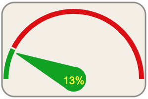

D3 KPI Gauge
===============


A kpi gauge written with D3.js that can be easily included in a project.



The code is based on [D3 Simple Gauge](https://github.com/antoinebeland/d3-simple-gauge.git)

Quick Start
-----------
The first step you need to do before to use the script is to include [D3.js v5](https://github.com/d3/d3) in your 
project.

Once you have included D3 in your dependencies, you have the following options to use the script:

- Clone the repo: `git clone https://github.com/kurtn/d3-kpi-gauge.git`
- Install with [npm](https://www.npmjs.com/package/d3-kpi-gauge): `npm install d3-kpi-gauge`

Be sure to include `d3-kpi-gauge.js` file in your project before to start.

Usage
-----
The gauge is very simple to use. You only have to initialize a new instance of the gauge with a configuration
like in the following example to make it work. Once the gauge is initialized, you can set the percentage position of
the needle with the `percent` or `value` properties.

```javascript
const svg = d3.select('body')
  .append('svg')
  .attr('width', 400)
  .attr('height', 250);


const kpiGauge = new window.d3KpiGauge.KpiGauge({
  el: svg.append('g'),        // The element that hosts the gauge
  height: 200,                // The height of the gauge   
  interval: [0, 200],         // The interval (min and max values) of the gauge (optional)
  kpi: 15,                    // The Gauge KPI limit (size of green arc)
  percent: 21,                // The initial percentage of he needle
  sectionsCount: 2,           // The number of sections in the gauge
  width: 400                  // The width of the gauge
});

setTimeout(() => {
  kpiGauge.percent = 70;  // The new percent of the needle to set (70%)
  
  setTimeout(() => {
    kpiGauge.value = 21;  // The new value of the needle to set inside the interval (21%)
  }, 1500);
}, 1500);
```
This script is written in ECMAScript 6 and is transpiled in [UMD](https://github.com/umdjs/umd) format. So, you can 
import it easily as a module. Look at the following examples to know how to import it:

```javascript
// In an ES6 application
import { KpiGauge } from './path/to/script/d3-kpi-gauge';

// In the browser
const KpiGauge = window.d3KpiGauge.KpiGauge
```

### Configuration
The gauge can be easily customized with the following parameters when you create a new instance of `SimpleGauge` class.
There are only four required parameters when you create a gauge. The others are optional (noted between `[]`).

| Name                  | Description                                                                                         |
| ----------------------| ----------------------------------------------------------------------------------------------------|
| `[animationDelay]`    | The delay in ms before to start the needle animation. By default, the value is `0`.                 |
| `[animationDuration]` | The duration in ms of the needle animation. By default, the value is `3000`.                        |
| `[barWidth]`          | The bar width of the gauge. By default, the value is `40`.                                          |
| `[chartInset]`        | The inset (margins) of the gauge inside the SVG container. By default the value is `10`.            |
| `[easeType]`          | The ease type to use for the needle animation. By default, the value is `d3.easeElastic`.           |
| `el`                  | The D3 element to use to create the gauge (must be a group or an SVG element).                      |
| `height`              | The height of the gauge.                                                                            |
| `[interval]`          | The interval (min and max values) of the gauge. By default, the interval is `[0, 1]`.               |
| `[kpi]`               | The Gauge KPI limit, this will set the two sector sizes og green (inside KPI) and red (outside KPI) |
| `[needleColor]`       | The colors to use for the needle, the color of the needle will change to above or below KPI.        |
| `[needleRadius]`      | The radius of the needle. By default, the radius is `15`.                                           |
| `[percent]`           | The percentage to use for the needle position. By default, the value is `0`.                        |
| `[sectionsColors]`    | An array that contains the color to apply for each section. In this version limited to 2 section    |
| `sectionsCount`       | Deprecated, will use 2 sections to reflect if needle value above or below KPI                       |
| `width`               | The width of the gauge.                                                                             |
| ----------------------| ----------------------------------------------------------------------------------------------------|

### Properties
Once the gauge is initialized, you can use the following properties to manipulate it.

| Name            | Description                                                                                                                                                                     |
| ----------------| --------------------------------------------------------------------------------------------------------------------------------------------------------------------------------|
| ```interval```  | Gets or sets the interval of the gauge (min and max values).                                                                                                                    |
| ```percent```   | Gets or sets the percentage of the gauge. The percent must be between [0,&nbsp;1].                                                                                                   |
| ```value```     | Sets the needle position based on the specified value inside the interval. If the value specified is outside the interval, the value will be clamped to fit inside the domain.  |

### Style
To apply colors on the gauge, you can specify them with the `needleColor` and `sectionsColors` properties in the
configuration or with CSS classes.

If you choose to use `needleColor` and `sectionsColors` properties to set colors, be sure to specify these properties 
in the configuration like in the following example. Noted that the color specified should be a valid 
[CSS color](https://www.w3schools.com/css/css_colors.asp).

```js
{
  // ...
  needleColor: 'black', // The needle color, overridden by value (green value <= kpi, red value > kpi)
  sectionsColors: [     // The color of each section
    'rgba(0, 172, 0, 1)',
    'rgba(225, 0, 0, 1)'
  ]
  ['rgba(0, 172, 0, 1)','rgba(225, 0, 0, 1)']
}
```

You can use CSS classes too to apply colors on the gauge. There are two classes used to set the needle colors 
(`needle` and `needle-center`), and there is one class for each group generated (`chart-color{i}`), where `{i}` is a 
number between 1 and the groups count, to apply a specific color to a group. You can take a look at the following 
example to know how to use these classes.

```css
/* Fill color for the first group */
.chart-color1 {
  fill: #dea82c !important;
}

/* Fill color for the second group */
.chart-color2 {
  fill: #e9621a !important;
}

/* Fill color for the needle */
.needle,
.needle-center {
  fill: #464A4F !important;
}
```

There are also other classes that can be used. Based on the percentage of the gauge, the arc points out by the needle
has the `active` class. This can be useful if you want to apply a different style to the active group. Also, when the 
minimum (0%) or the maximum (100%) of the gauge are reached, the gauge element has `min` or `max` classes. Look at the
following examples to know how to use these classes.

```css
/* Put the active group always in black */
.arc.active {
  fill: #000 !important;
}

/* When the gauge is at 0%, all the arcs appear blue */ 
.min .arc {
  fill: #00f !important;
}

/* When the gauge is at 100%, all the arcs appear red */
.max .arc {
  fill: #f00 !important;
}
```

If you have used `sectionsColor` properties to set group colors, you have to add `!important` rule with the
`fill` property if you want that `active`, `min` or `max` classes can be applied.     

License
-------
The code of this project is under MIT license.
